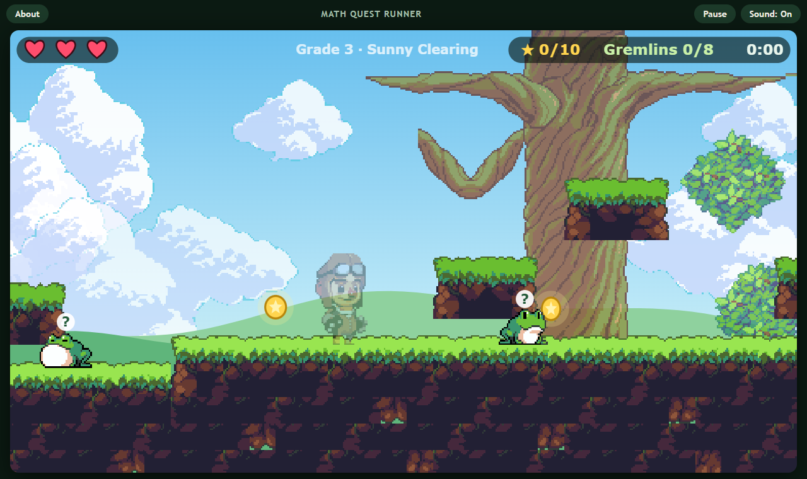
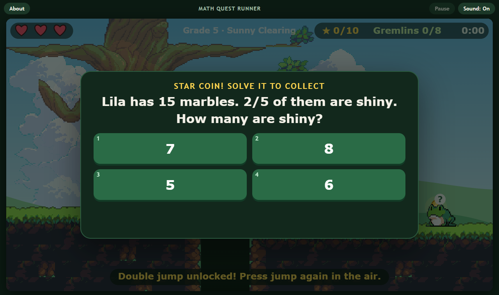
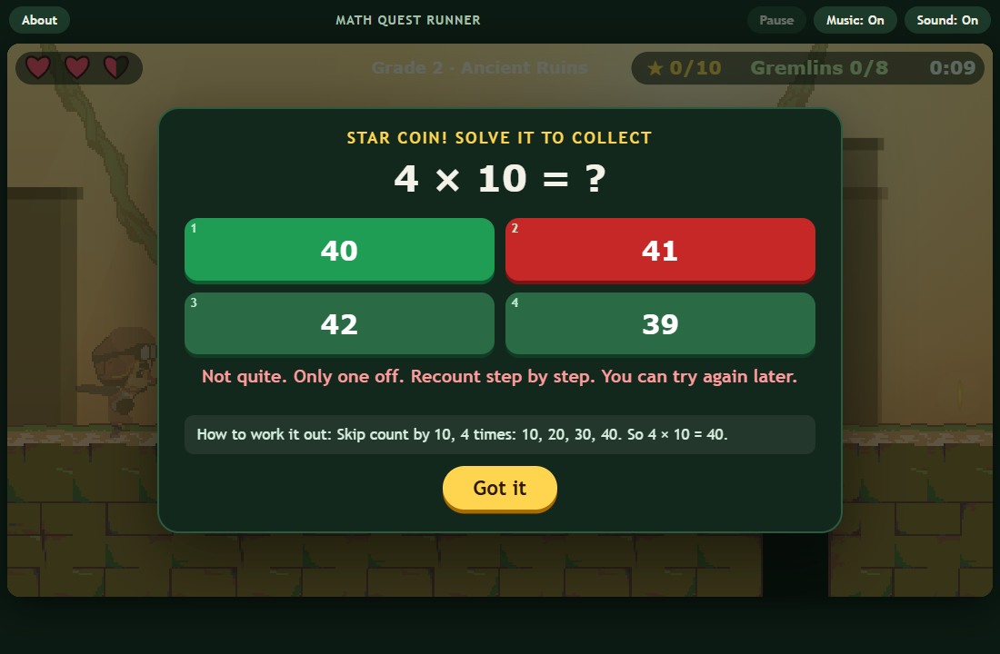
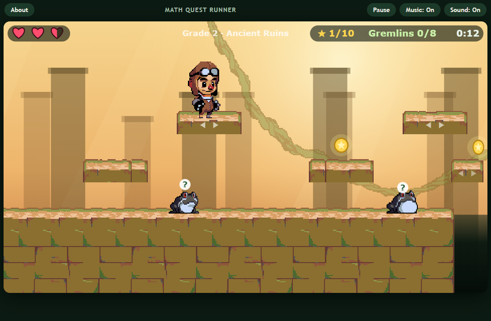
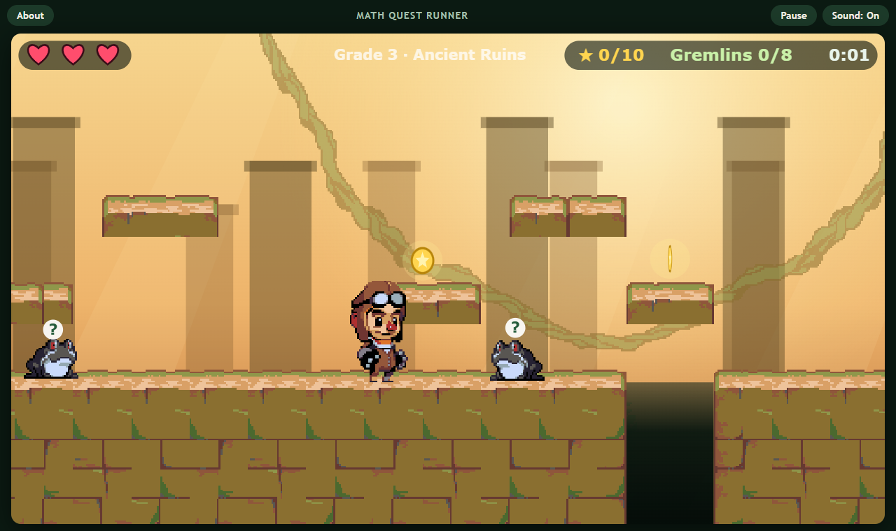
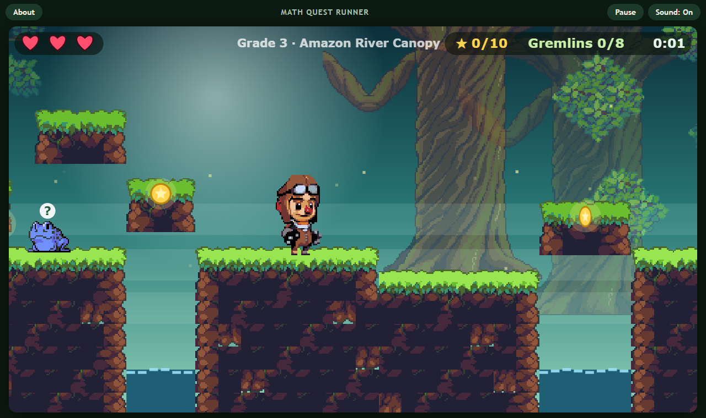

# Math Quest Runner

[](https://github.com/Zaarnno-Dev-Hub-dot/math-quest-runner/actions/workflows/test.yml)
[](LICENSE)

A pixel-art jungle platformer where every **star coin** and **gremlin** asks a math question. Pick your grade (1 to 5), run through three levels, and stomp gremlins by solving the problem they ask. Runs in any modern browser, on a keyboard or a touch screen. No sign-up, no ads, no tracking.

### [Play it in your browser](https://zaarnno-dev-hub-dot.github.io/math-quest-runner/)



## How it plays

- **Run and jump** with A / D (or the arrow keys) and Space, W or Up. A double-jump unlocks a little way into level 1. On a phone or tablet, on-screen buttons appear.
- **Touch a star coin or a gremlin** and the game pauses on a question with four answers (keys 1 to 4, or tap). Right: the coin is collected, or the gremlin is stomped. Wrong: you lose **half a heart**, the coin or gremlin stays so you can try again, and the game shows **why** your pick was wrong plus a short worked solution. It waits for you to tap *Got it* (or press Enter), so there is time to read.
- **Finish a level** by reaching the flag with at least **8 of 10 star coins** and **6 of 8 gremlins**. You have 3 hearts, and falling into a gap also costs half a heart.
- **Stars:** 1 for finishing, 2 for 85% or more correct, 3 for that plus every coin and every gremlin. Best stars, accuracy and time are saved on your device for each grade.





- **Moving platforms** appear in the Ancient Ruins and the River Canopy: some floating platforms slide sideways, ferry you over gaps, or bob up and down. Hop on and you ride along. They are shortcuts to coins; every level can still be finished with plain jumps.
- **Music:** an original tune for each level plays while you run (softer during a question). *Music* and *Sound* have separate buttons at the top.



## What each grade practices

| Grade | Topics |
|---|---|
| 1 | Adding and subtracting within 20, then word problems |
| 2 | Adding and subtracting within 100, intro times tables (level 2), word problems with equal groups |
| 3 | Multiplication facts, division facts, multiplication and sharing word problems |
| 4 | Two-digit times one-digit, equivalent fractions, adding fractions, comparing fractions, fractions of a set |
| 5 | Adding fractions with different bottoms, decimals, multiplying by 10 and 100, order of operations |

Level 1 is the gentlest version of the grade's topic, level 3 the hardest (and includes word problems).

| Ancient Ruins | Amazon River Canopy |
|---|---|
|  |  |

## Run it locally

No build step and no dependencies. Serve the folder and open it:

```bash
git clone https://github.com/Zaarnno-Dev-Hub-dot/math-quest-runner.git
cd math-quest-runner
python -m http.server 8000
```

Then open http://localhost:8000.

## For developers

- `js/math.js` makes the questions (each with a worked solution and a reason for every wrong choice), `js/levels.js` builds the three levels from a fixed seed, `js/physics.js` is the platformer physics (including moving platforms), `js/music.js` generates the music, and `js/game.js` draws everything and runs the screens. `js/sprites.js` is generated.
- `npm test` (Node 22, no packages needed) generates 60,000 questions and checks every answer against an independent calculation, checks that every question has a worked solution and a reason for each wrong choice, checks the music patterns, tests the moving-platform physics (landing, riding, one-way from below, walls), then runs a bot through all three levels, plus 180 other level seeds, to prove each one can be finished with single jumps only.
- `python tools/build_sprites.py` turns the pack's animated GIFs into sprite strips (browsers draw only the first frame of a GIF on a canvas). Needs Pillow.
- `node tools/capture-screenshots.mjs` regenerates `docs/screenshots/` with headless Chrome or Edge. Serve the folder on port 8766 first.
- Open `index.html?debug` to get a `window.__mqr` object for scripted play-tests.

## What is not built yet

Accounts, cloud saves and a global leaderboard from the [spec](docs/PRD.md); crumbling platforms. See the [roadmap](docs/ROADMAP.md).

## License

MIT for the code and docs ([LICENSE](LICENSE)). The art is CC0; see [CREDITS.md](CREDITS.md).