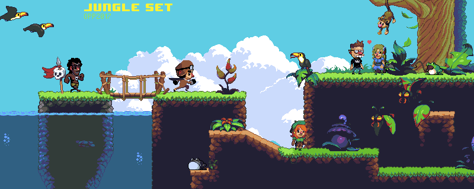

# Math Quest Runner

A pixel-art jungle platformer where every coin and gremlin asks a math question. Your grade picks the topic,
and a wrong answer costs half a heart.

> **Status: design and art prototype, on hold.** The spec and the art direction are done, but the Godot scenes
> are early drafts that do not open cleanly yet, so there is nothing to play here.
> **Looking for finished math games?** Try **MathMan** and the rest of the
> [Learning Arcade](https://github.com/Zaarnno-Dev-Hub-dot/zaarno-learning-arcade), free and playable in a browser.

Art direction: a mockup that ships with the CC0 OPP jungle tileset, not a screenshot of this game.

## The idea

- Pick Grade 1 to 5; the whole session uses that grade's math topic (add/subtract up to fractions and decimals).
- Coins and gremlins stay blank until you touch them, then show a problem. Right: collect or stomp. Wrong: lose half a heart.
- Three jungle levels per grade (Sunny Clearing, Ancient Ruins, Amazon River Canopy), double-jump taught in level 1.
- Guest play, optional login, and a per-grade leaderboard.

The full spec is in [docs/PRD.md](docs/PRD.md).

## What is in this repo

| Path | What it is | State |
|---|---|---|
| `docs/PRD.md` | Product spec | Draft |
| `docs/ROADMAP.md` | What is left to build | Current |
| `godot/` | Player controller, gremlin patrol, and a Level 1 scene | Early drafts, see known issues |
| `assets/opp-jungle/` | CC0 jungle tileset and sprites | Ready to use |

## Known issues

- `godot/L1.tscn` and `godot/player.tscn` were generated and never run in the editor. They reference sprite files
  that are not in this repository (`kenney_platformer/...`), point at resources that are not declared, and will
  need to be rebuilt in Godot's editor.
- Math gates, the question bank, the later levels, audio, the backend and the leaderboard do not exist yet.
- Tested by reading only: the Godot fixes in the latest commit (HTML-escaped quotes removed, a missing input call
  replaced) were made without Godot installed.

## Open it anyway

Install [Godot 4.x](https://godotengine.org/), open `godot/project.godot`, and expect to repair the level scene
before it will run.

## License

MIT for the code and docs ([LICENSE](LICENSE)). The jungle art is CC0; see [CREDITS.md](CREDITS.md).